# SkillBridge 🚀

SkillBridge is a full-stack platform that connects Tier-2 and Tier-3 college students with real work opportunities from local MSMEs. It uses verified skills, TrustScore, tasks, gigs, networking, and payments to promote merit-based hiring. 🎓🤝🏢

## 🔗 Live Demo

https://skillbridge.debarghya.org

## 💡 Motivation

Many talented students from Tier-2 and Tier-3 colleges struggle to access real work opportunities because hiring often depends on college reputation, networks, or location instead of actual skills. SkillBridge was built to reduce that gap by helping students prove what they can do through verified skills, TrustScore, practical tasks, and project-based gigs.

For local MSMEs, the platform creates a simple way to discover skilled student talent, assign meaningful work, review submissions, manage projects, and handle payments in one connected workflow.

## ✨ Features

### 🎓 Student Side

- GIG Center to discover opportunities, manage applied gigs, track active work, view completed gigs, and save interesting roles
- Direct company invites with accept, decline, and interview-task flows
- Practical task submission system with project links, notes, and company review visibility
- TrustScore dashboard that reflects skill verification, project work, consistency, and task behavior
- Skill Hub for verified skills, skill upgrades, daily retention tasks, and skill-gap reports
- Profile and portfolio builder with skills, projects, GitHub links, contact details, and intro video support
- Peer networking through student discovery, saved connections, and team-up collaboration requests
- Earnings dashboard with payment history and withdrawal flow

### 🏢 Company Side

- Business profile setup with hiring categories, work modes, location, and company details
- GIG Management for creating gigs, editing roles, tracking posted gigs, and reviewing applicants
- Talent Search with TrustScore, skill, location, and experience-level filters
- Student profile previews with verified skills, TrustScore, projects, contact details, and intro video
- Interview-task review workflow with statuses like reviewed, ready to hire, and needs revision
- Project Workspace for active project tracking, team members, task progress, and delivery status
- Payment Center with company wallet, escrow tracking, payment methods, and payout history
- Persistent dashboard state for gigs, workspace, payments, and business profile data

## 🏗️ Architecture

### 1. 3-Tier Client-Server Architecture

```text
┌─────────────────────────────────────────────────────────────┐
│                      Presentation Layer                     │
│                                                             │
│  React + Vite Client                                        │
│  - Landing Page                                             │
│  - Student Dashboard                                        │
│  - Company Dashboard                                        │
│  - GIG, Skill Hub, Network, Workspace, Payment UI            │
└──────────────────────────────┬──────────────────────────────┘
                               │
                               │ HTTP / JSON API
                               │
┌──────────────────────────────▼──────────────────────────────┐
│                       Application Layer                     │
│                                                             │
│  Node.js Backend                                            │
│  - Native HTTP Server                                       │
│  - API Routing                                              │
│  - Controllers                                              │
│  - Auth Sessions                                            │
│  - Rate Limiting                                            │
│  - Business Logic                                           │
└──────────────────────────────┬──────────────────────────────┘
                               │
                               │ Mongoose ODM
                               │
┌──────────────────────────────▼──────────────────────────────┐
│                          Data Layer                         │
│                                                             │
│  MongoDB Database                                           │
│  - Students                                                 │
│  - Companies                                                │
│  - Task Submissions                                         │
│  - Dashboard State                                          │
│  - Sessions                                                 │
└─────────────────────────────────────────────────────────────┘
```

### 2. System Architecture & Workflow Diagram

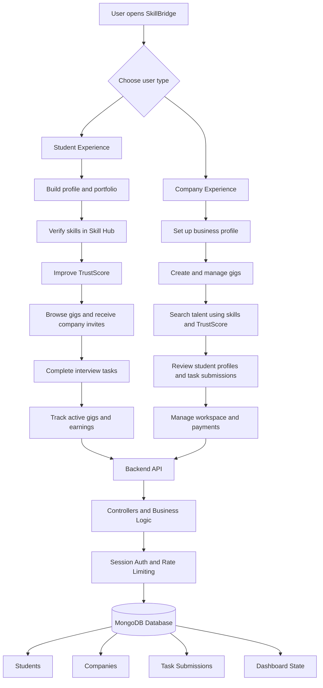

## 📁 Folder Structure

```text
skillbridge/
├── .github/
│   └── workflows/
│       └── ci.yml
├── client/
│   ├── public/
│   │   ├── favicon.svg
│   │   ├── icons.svg
│   │   └── logo.png
│   ├── src/
│   │   ├── assets/
│   │   ├── company/
│   │   ├── config/
│   │   ├── landingpage/
│   │   ├── lib/
│   │   ├── student/
│   │   │   ├── earning/
│   │   │   ├── gig/
│   │   │   ├── network/
│   │   │   ├── skillhub/
│   │   │   └── task/
│   │   ├── ui/
│   │   ├── App.jsx
│   │   ├── main.jsx
│   │   └── index.css
│   ├── package.json
│   └── vite.config.js
├── server/
│   ├── config/
│   ├── controllers/
│   ├── models/
│   ├── tests/
│   ├── utils/
│   ├── .env.example
│   ├── package.json
│   └── server.js
├── .gitignore
├── render.yaml
└── README.md
```

## 🗄️ Database Design

### 1. Database Schema / Entity Relationship Diagram (ERD)

SkillBridge uses MongoDB with Mongoose. The backend currently has three main collections: `students`, `companies`, and `tasksubmissions`.

#### Main Collections

| Module | Collections | Stored Data |
| --- | --- | --- |
| Student Profile | `students` | Student identity, contact details, location, preferred language, portfolio links, projects, intro video, skills, and TrustScore. |
| Student GIGs | `students` | GIG opportunities, browsed gigs, saved gig IDs, applied gig IDs, active gigs, completed gigs, and invite status. |
| Skill Hub | `students` | Verified skills, skill levels, categories, renewal status, trust gain/loss values, streaks, and missed days. |
| Network | `students` | Peer discovery state, saved connections, team-up requests, accepted requests, and network activity. |
| Earnings | `students` | Wallet stats, payment history, UPI accounts, selected withdrawal method, and withdrawal amount. |
| Company Profile | `companies` | Business identity, contact details, GSTIN/business document data, location, hiring categories, work modes, and business profile setup. |
| Company GIG Management | `companies` | Posted gigs, applicant pipeline, review stages, recent activity, and task-review state. |
| Company Workspace | `companies` | Active projects, project status, workspace tasks, team members, deadlines, and delivery progress. |
| Company Payments | `companies` | Company wallet, escrow tracking, payment methods, payout history, and payment dashboard state. |
| Task Review | `tasksubmissions` | Student task submissions, project links, notes, matched skills, company review status, feedback, and submission timestamps. |
| Sessions & Usage | `students`, `companies` | Session tokens, session creation time, daily section usage, and request-limit related account activity. |

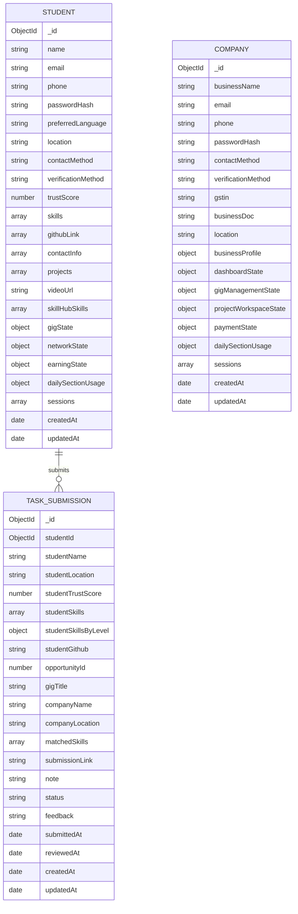

Key relationships:

- `TaskSubmission.studentId` references a `Student`.
- Student and company sessions are stored inside their respective documents.
- Student dashboard sections such as gigs, skills, network, and earnings are persisted as nested state.
- Company dashboard sections such as gig management, workspace, and payments are persisted as nested state.

## 🖼️ Screenshots

Screenshots from the main SkillBridge user flows.

| Page / Flow | Preview |
| --- | --- |
| Landing Page | 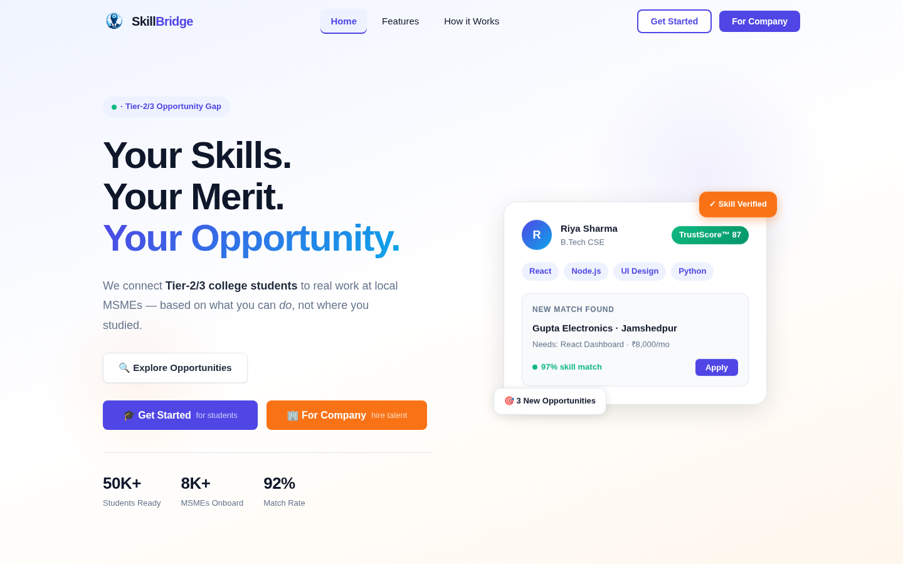 |
| Student Dashboard / GIG Center | 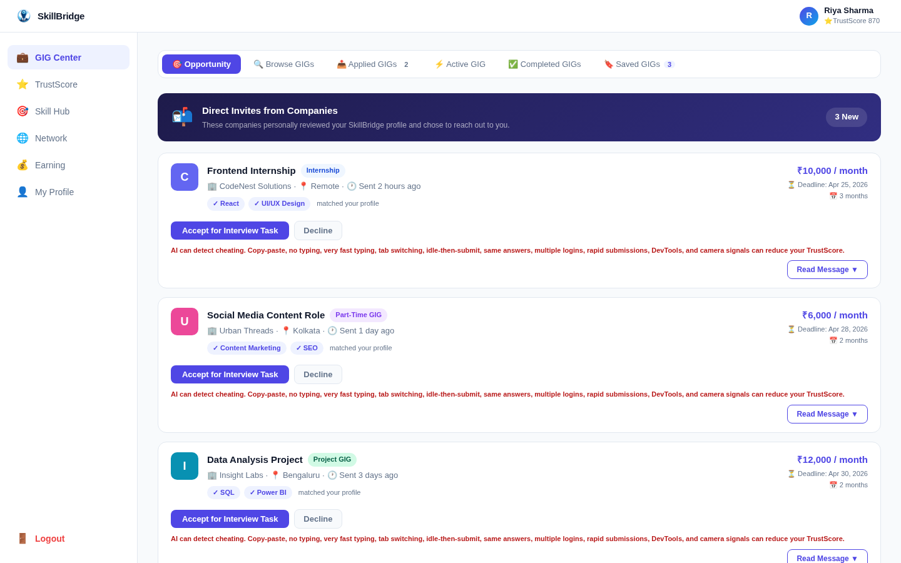 |
| Skill Hub | 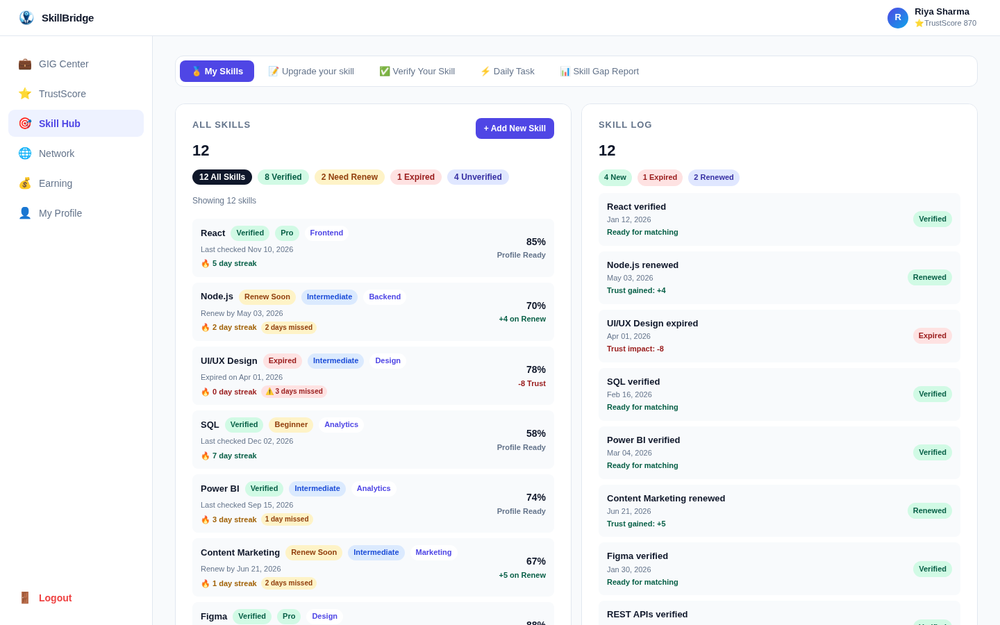 |
| Student Network | 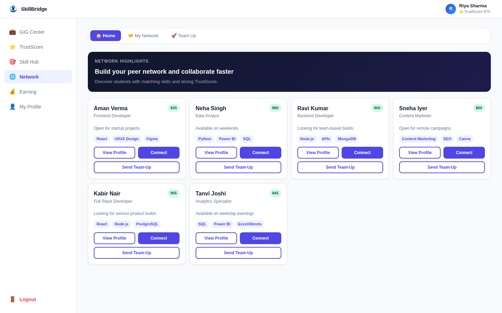 |
| Company Dashboard | 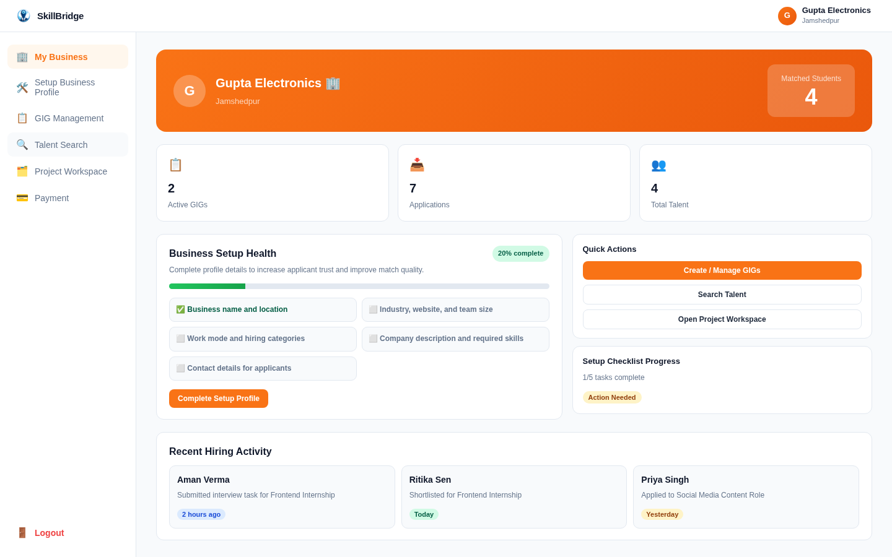 |
| GIG Management | 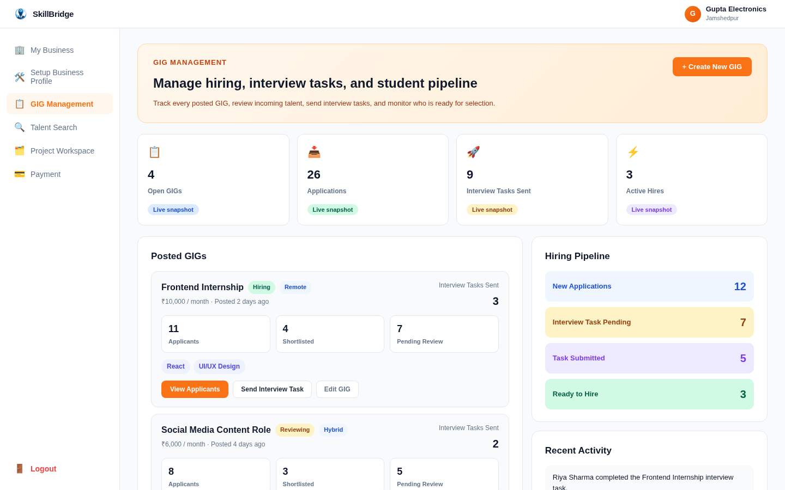 |
| Talent Search | 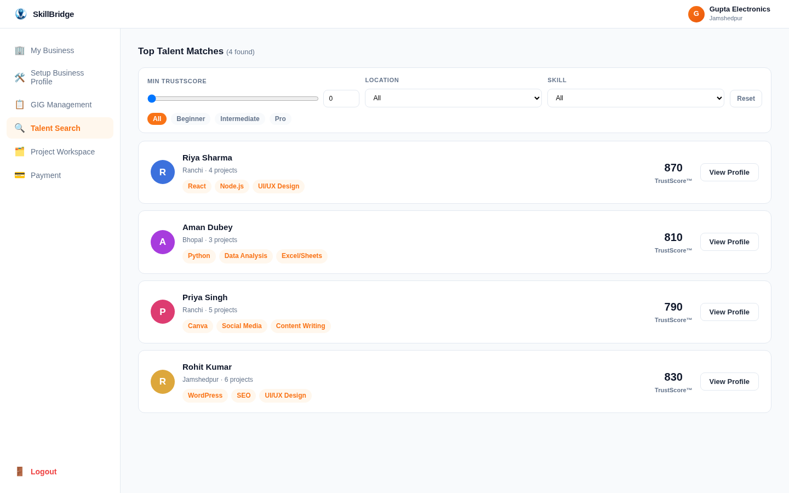 |
| Project Workspace | 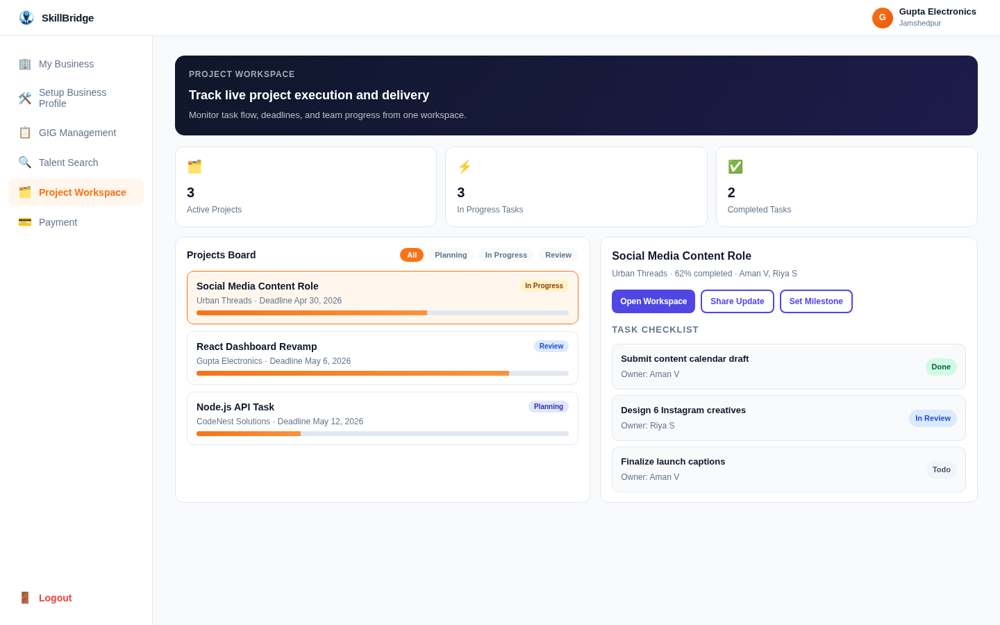 |
| Payment Center | 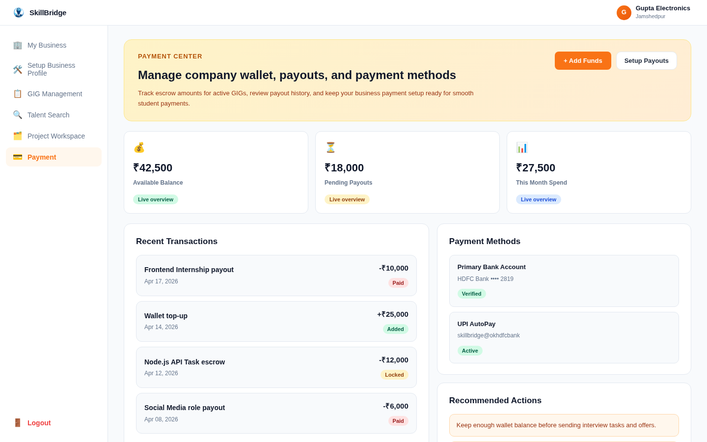 |

## 🧰 Tech Stack

| Layer | Technologies |
| --- | --- |
| Frontend | React, React Router DOM, Vite, CSS |
| Backend | Node.js, Native HTTP Server |
| Database | MongoDB, Mongoose |
| Authentication | Custom session tokens, password hashing with Node.js `crypto` |
| API Format | REST-style JSON APIs |
| Testing | Node.js Test Runner, ESLint |
| Deployment | Render backend configuration |
| CI/CD | GitHub Actions |

## ⚙️ Installation

Clone the repository:

```bash
git clone https://github.com/debarghya131/Skill-Bridge.git
cd Skill-Bridge
```

Install and run the backend:

```bash
cd server
npm install
npm run dev
```

Install and run the frontend in a new terminal:

```bash
cd client
npm install
npm run dev
```

The frontend runs on:

```text
http://localhost:5173
```

The backend runs on:

```text
http://localhost:5000
```

## 🔐 Environment Variables

Create a `.env` file inside the `server/` folder:

```bash
cd server
cp .env.example .env
```

Server environment variables:

| Variable | Description |
| --- | --- |
| `NODE_ENV` | Application environment, such as `development` or `production` |
| `MONGO_URL` | MongoDB connection string |
| `PORT` | Backend server port |
| `CORS_ORIGIN` | Allowed frontend origin |
| `SESSION_TTL_DAYS` | Number of days before a session expires |
| `MAX_SESSIONS_PER_ACCOUNT` | Maximum active sessions allowed per account |
| `RATE_LIMIT_WINDOW_MS` | Rate-limit time window in milliseconds |
| `RATE_LIMIT_MAX_REQUESTS` | Maximum general requests allowed per window |
| `AUTH_RATE_LIMIT_MAX_REQUESTS` | Maximum auth requests allowed per window |
| `DAILY_USER_RATE_LIMIT_MAX_REQUESTS` | Maximum authenticated requests allowed per user per day |
| `DAILY_SECTION_OPERATION_LIMIT` | Maximum write operations per section per day |
| `LOG_LEVEL` | Server logging level |

Example:

```env
NODE_ENV=development
MONGO_URL=your_mongodb_connection_string
PORT=5000
CORS_ORIGIN=http://localhost:5173
SESSION_TTL_DAYS=30
MAX_SESSIONS_PER_ACCOUNT=5
RATE_LIMIT_WINDOW_MS=60000
RATE_LIMIT_MAX_REQUESTS=120
AUTH_RATE_LIMIT_MAX_REQUESTS=12
DAILY_USER_RATE_LIMIT_MAX_REQUESTS=2000
DAILY_SECTION_OPERATION_LIMIT=2
LOG_LEVEL=info
```

Frontend environment variable:

| Variable | Description |
| --- | --- |
| `VITE_API_URL` | Backend API URL used by the React client |

Example `client/.env`:

```env
VITE_API_URL=http://localhost:5000
```

## 🚧 Challenges Faced

- Designing a two-sided platform that serves both students and companies without making the user flow confusing.
- Managing many dashboard sections such as GIGs, Skill Hub, Network, Earnings, Talent Search, Workspace, and Payments.
- Persisting complex dashboard state while still keeping default demo data available for new users.
- Building a merit-based hiring flow where TrustScore, verified skills, tasks, and project submissions work together.
- Handling authentication, session expiry, request limits, and protected routes without using a heavy backend framework.
- Keeping the frontend responsive and organized across multiple student and company workflows.
- Preparing the project for deployment with proper environment variables, health checks, and CI checks.

## ✅ Solutions Implemented

- Split the product into clear student and company dashboards with separate navigation and focused workflows.
- Created reusable API helpers and dashboard state handlers to keep frontend-backend communication consistent.
- Used MongoDB with Mongoose models for students, companies, sessions, dashboard state, and task submissions.
- Added template-state merge and reduce utilities so default data can be reused without storing unnecessary duplicate state.
- Implemented custom session-token authentication with password hashing, session cleanup, and logout support.
- Added rate limiting, daily user limits, daily section operation limits, CORS handling, and security headers.
- Built task submission and review flows so companies can evaluate students through practical work instead of only profile data.
- Added GitHub Actions for backend checks/tests and frontend builds, plus Render configuration for backend deployment.

## 🔮 Future Improvements

- Add real-time chat between students and companies for project discussions.
- Add email or SMS notifications for invites, task reviews, payments, and hiring updates.
- Improve TrustScore with more detailed scoring rules, company ratings, and verified project outcomes.
- Add advanced search and recommendation logic for better student-gig matching.
- Move authentication to secure HTTP-only cookies for stronger session protection.
- Add file upload support for resumes, certificates, business documents, and task attachments.
- Add admin moderation for users, companies, reported profiles, and suspicious task activity.
- Add more automated tests for API routes, dashboard workflows, and frontend components.
- Optimize frontend bundle size with route-based code splitting.
- Add analytics dashboards for platform growth, hiring conversion, and student success metrics.

## 📚 Learnings

- Learned how to design a full-stack, two-sided marketplace with separate student and company journeys.
- Learned how to structure a React app with multiple dashboards, nested feature modules, and reusable API helpers.
- Learned how to persist complex user-specific dashboard state in MongoDB.
- Learned how to implement custom session-based authentication with password hashing and token expiry.
- Learned how to add backend safety features such as rate limiting, CORS, security headers, and health checks.
- Learned how to connect practical task submissions with a company review pipeline.
- Learned how to prepare a project for deployment using environment variables, CI checks, and Render configuration.

## 👤 Author Details

**Debarghya Bandyopadhyay**

- Computer Science engineering student and developer from Kolkata

### Be My Friend

I always like to make new friends. Follow me on:

[](https://www.linkedin.com/in/debarghya-bandyopadhyay-953b02400?utm_source=share_via&utm_content=profile&utm_medium=member_android)

[](https://x.com/debarghya131)

[](https://github.com/debarghya131)

[](https://portfolio.debarghya.org)

[](mailto:debarghyabandyopadhyay191@gmail.com)
